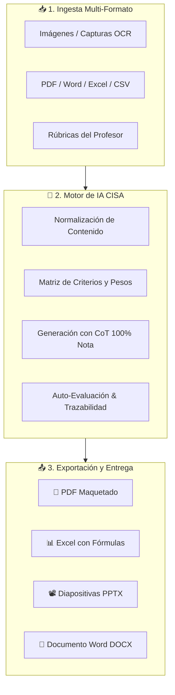

# 🎓 CISA Studio — Generador Inteligente de Tareas Basado en Rúbricas

<div align="center">

[](https://github.com/bbaakkuu-svg/CISA_Studio)
[](https://react.dev/)
[](https://supabase.com/)
[](https://capacitorjs.com/)
[](./WorkFlow)
[]()

<p align="center">
  <strong>Plataforma universal de ingesta multi-formato y resolución técnica orientada estrictamente al 100% de la rúbrica docente.</strong>
</p>

</div>

---

## 📑 Tabla de Contenidos
- [1. Visión General](#1-visión-general)
- [2. Arquitectura del Sistema](#2-arquitectura-del-sistema)
- [3. Estructura Multi-Agente](#3-estructura-multi-agente)
- [4. Pipeline de Ingesta & Exportación](#4-pipeline-de-ingesta--exportación)
- [5. Stack Tecnológico](#5-stack-tecnológico)
- [6. Ecosistema de Automatización (DevOps & Mobile)](#6-ecosistema-de-automatización-devops--mobile)
- [7. Guía de Instalación y Despliegue](#7-guía-de-instalación-y-despliegue)
- [8. Hoja de Ruta (Roadmap)](#8-hoja-de-ruta-roadmap)

---

## 1. Visión General
**CISA Studio** (Célula de Ingeniería de Soluciones Académicas) resuelve la brecha entre los enunciados de tareas complejas y la evaluación exigida por los profesores.

- **Entrada Universal:** Procesa documentos en formatos PDF, Word (`.docx`), Excel (`.xlsx`), CSV, texto plano e imágenes/capturas vía OCR.
- **Alineación de Rúbricas:** Extrae los criterios y ponderaciones para estructurar una solución calibrada al 100% de la nota máxima.
- **Exportación Multi-Formato:** Genera entregables en PDF maquetado, libros de Excel con fórmulas, presentaciones PowerPoint (`.pptx`) y documentos Word listos para entrega.

---

## 2. Arquitectura del Sistema



---

## 3. Estructura Multi-Agente

El desarrollo y mantenimiento de CISA Studio se organiza bajo una jerarquía de 4 agentes especializados:

| Agente | Rol | Responsabilidades Clave |
| :--- | :--- | :--- |
| **Agente 1** | 📘 **Documentación** | Mantenimiento de `README.md`, `ARCHITECTURE.md`, especificaciones API y diccionarios de datos. |
| **Agente 2** | 🎨 **Frontend & UI/UX** | Interfaz React 19 + Tailwind v4, modo oscuro, dropzone inteligente y previsualizadores. |
| **Agente 3** | ⚙️ **Backend & Supabase** | Postgres con RLS, Supabase Storage, Realtime, motor IA y bot Keep-Alive. |
| **Agente 4** | 🛡️ **Auditor & DevOps** | Control de calidad, auditoría de seguridad, gestión de ramas con [WorkFlow](./WorkFlow) y empaquetado a APK con [ApkFlow](./ApkFlow). |

---

## 4. Pipeline de Ingesta & Exportación

```
[Usuario] ──> (Enunciado + Rúbricas)
                 │
                 ▼
        [Supabase Storage]
                 │
                 ▼
        [Extractor de Contenido] ── OCR / PDF Parser / Sheet Parser
                 │
                 ▼
        [Motor de Resolución CISA] ──> Calibración con Rúbrica al 100%
                 │
                 ▼
        [Compiladores de Salida] ──> PDF / XLSX / PPTX / DOCX
```

---

## 5. Stack Tecnológico

- **Frontend:** React 19, TypeScript, Tailwind CSS v4, Lucide React, Framer Motion.
- **Backend & DB:** Supabase (PostgreSQL, Row Level Security, Auth, Storage, Edge Functions).
- **Parsers:** `pdf-parse`, `mammoth`, `xlsx`, `papaparse`, OCR Vision.
- **Generadores:** `@react-pdf/renderer`, `ExcelJS`, `PptxGenJS`, `docx`.
- **Móvil:** Capacitor 8 + Android SDK 36 (vía [ApkFlow](./ApkFlow)).
- **DevOps:** GitHub CLI + Framework [WorkFlow](./WorkFlow).

---

## 6. Ecosistema de Automatización (DevOps & Mobile)

### 🛠️ WorkFlow Elite (DevOps)
Herramientas automatizadas en PowerShell para gestión de Git y GitHub:
- `WorkFlow/01_Setup_Repo.ps1`: Inicialización de repositorio y ramas `main`/`develop`.
- `WorkFlow/03_Nueva_Rama.ps1`: Creación de ramas `feature/`, `bugfix/` o `hotfix/`.
- `WorkFlow/04_Commit_y_Push.ps1`: Commits estandarizados y push automático.
- `WorkFlow/05_Crear_PullRequest.ps1`: Creación de PRs con plantillas predefinidas.
- `WorkFlow/08_Publicar_Release.ps1`: Publicación y versionado semántico.

### 📱 ApkFlow (Mobile Build Engine)
Transformación y empaquetado del frontend web a binario nativo Android firmado:
- `ApkFlow/00_Check_Environment.ps1`: Diagnóstico de JDK, Android SDK y Gradle.
- `ApkFlow/01_Init_Capacitor.ps1`: Inicialización de plataforma Android.
- `ApkFlow/02_Setup_Keystore.ps1`: Generación de Keystore criptográfico RSA 2048-bit.
- `ApkFlow/03_Sync_Web_Assets.ps1`: Sincronización de bundle web compilado.
- `ApkFlow/04_Build_Signed_APK.ps1`: Compilación de APK Release firmado (v1 & v2).
- `ApkFlow/05_Run_Full_Pipeline.ps1`: Pipeline completo en 1 clic.

---

## 7. Guía de Instalación y Despliegue

### Requisitos Previos
- Node.js 20+ y `npm`
- Git y GitHub CLI (`gh`) autenticado
- Cuenta en Supabase (o instancia local)
- Java JDK 17+ y Android SDK (para compilación móvil con ApkFlow)

### Inicio Rápido
```bash
# 1. Clonar el repositorio
git clone https://github.com/bbaakkuu-svg/CISA_Studio.git
cd CISA_Studio

# 2. Instalar dependencias del proyecto web
npm install

# 3. Configurar variables de entorno
cp .env.example .env.local

# 4. Iniciar servidor de desarrollo
npm run dev
```

---

## 8. Hoja de Ruta (Roadmap)
- [x] **Fase 1:** Inicialización del repositorio y estructura DevOps con WorkFlow.
- [ ] **Fase 2:** Despliegue del esquema de Supabase, Storage buckets y bot Keep-Alive.
- [ ] **Fase 3:** Desarrollo de la interfaz de usuario en React + Tailwind (Dropzone, Rúbricas y Visores).
- [ ] **Fase 4:** Integración del motor de extracción, resolución de tareas y generadores multi-formato.
- [ ] **Fase 5:** Auditoría de seguridad y pruebas de consistencia de rúbricas.
- [ ] **Fase 6:** Compilación y distribución del APK Android con ApkFlow.

---

<div align="center">
  Desarrollado con arquitectura Multi-Agente • 2026
</div>
