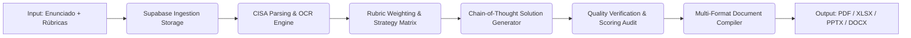

# 🏛️ Documento de Arquitectura de Software: CISA Studio

**Versión:** 1.0.0  
**Autor:** Agente 1 (Documentación & Arquitectura)  
**Revisor:** Agente 4 (Auditor & DevOps)  

---

## 1. Visión General de la Arquitectura

CISA Studio está construido bajo el patrón de **Arquitectura Desacoplada Orientada a Eventos y Rúbricas**. La aplicación permite resolver tareas académicas de alta complejidad siguiendo estrictamente una matriz de criterios de evaluación.

---

## 2. Modelo de Datos (PostgreSQL en Supabase)

### Entidades Principales
1. **`profiles`**: Información de usuarios autenticados, rol y configuración de exportación preferida.
2. **`tasks`**: Registro de la tarea (título, descripción, estado: `pending`, `processing`, `completed`, `error`).
3. **`task_files`**: Archivos de entrada subidos (PDF, imágenes, hojas de cálculo) y referencias a Supabase Storage.
4. **`rubrics`**: Criterios de evaluación parseados, ponderación de puntos (0 a 100%) y descripciones de excelencia.
5. **`solutions`**: Contenido generado, matriz de auto-evaluación y URLs a los archivos de salida generados.
6. **`audit_logs`**: Registro histórico de validaciones del Agente 4 (tiempos de inferencia, coherencia de rúbrica).

---

## 3. Bot Anti-Suspensión (Keep-Alive) de Supabase

Para cumplir con la política de inactividad de proyectos en el nivel gratuito de Supabase (pausa tras 7 días sin tráfico), se implementa un workflow en GitHub Actions:

- **Frecuencia:** Cada 3 días (`cron: '0 0 */3 * *'`).
- **Acción:** Realiza una petición `GET /rest/v1/profiles?select=count` autenticada con la `anon_key` o ejecuta un ping a la base de datos.
- **Ubicación:** `.github/workflows/supabase-keep-alive.yml`.

---

## 4. Pipeline de Conversión Móvil (ApkFlow)

El frontend de React se sincroniza directamente con el entorno de Capacitor:
1. `npm run build` genera la carpeta `dist/`.
2. `ApkFlow/03_Sync_Web_Assets.ps1` inyecta los assets a `android/app/src/main/assets/public/`.
3. `ApkFlow/04_Build_Signed_APK.ps1` ejecuta Gradle Wrapper y firma el archivo con Keystore RSA de 2048 bits.
4. El binario resultante queda depositado en `ApkFlow/output/CISAStudio-v1.0.0-signed.apk`.
