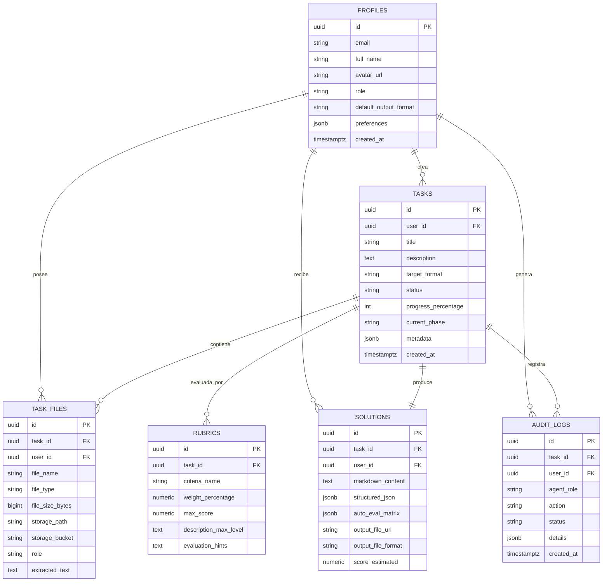

# 🗄️ Diccionario y Manual de Base de Datos: CISA Studio

**Motor:** PostgreSQL 15+ (Supabase)  
**Módulo de Seguridad:** Row Level Security (RLS) habilitado en el 100% de las tablas  
**Autor:** Agente 3 (Backend & Base de Datos)  
**Revisor:** Agente 1 (Documentación) & Agente 4 (Auditor)  

---

## 1. Diagrama Entidad-Relación (ERD)

---

## 2. Diccionario de Tablas

### 2.1. `public.profiles`
Sincronizada automáticamente con `auth.users` mediante el trigger `on_auth_user_created`.
- `id` (UUID, PK): Referencia a `auth.users(id)`.
- `email` (TEXT, NOT NULL): Correo electrónico del usuario.
- `full_name` (TEXT): Nombre completo.
- `avatar_url` (TEXT): URL de foto de perfil.
- `role` (TEXT): Rol del usuario (`student`, `educator`, `researcher`, `admin`).
- `default_output_format` (TEXT): Formato preferido por defecto (`pdf`, `xlsx`, `pptx`, `docx`, `code`).

### 2.2. `public.tasks`
Registro central de cada tarea procesada por el motor CISA.
- `id` (UUID, PK): Identificador único de la tarea.
- `user_id` (UUID, FK): Propietario de la tarea (`profiles.id`).
- `title` (TEXT): Título o materia de la tarea.
- `target_format` (TEXT): Formato final solicitado (`pdf`, `xlsx`, `pptx`, `docx`, `code`).
- `status` (TEXT): Estado actual (`pending`, `processing`, `completed`, `failed`).
- `current_phase` (TEXT): Fase de la pipeline CISA (`inbox`, `detection`, `normalization`, `rubric_analysis`, `solution_generation`, `exporting`, `ready`).

### 2.3. `public.task_files`
Almacena los metadatos de los archivos de entrada y referencias a Supabase Storage.
- `storage_bucket`: Bucket de almacenamiento (por defecto `inbox-tasks`).
- `role`: Rol del archivo (`statement` = enunciado, `rubric` = rúbricas, `supporting_data` = datos adicionales).
- `extracted_text`: Texto normalizado extraído mediante OCR o parsers.

### 2.4. `public.rubrics`
Desglose estructurado de las rúbricas y criterios de evaluación.
- `criteria_name`: Nombre del criterio (ej. "Rigor Metodológico", "Código Limpio").
- `weight_percentage`: Peso porcentual del criterio (ej. 30.00%).
- `description_max_level`: Descripción explícita de lo que exige el docente para dar el 100% de la nota.

### 2.5. `public.solutions`
Resultado de la resolución generada por el motor IA y matrices de validación.
- `markdown_content`: Texto estructurado de la solución completa.
- `auto_eval_matrix`: JSON con la justificación y evidencia de cumplimiento para cada criterio de la rúbrica.
- `output_file_url`: Enlace de descarga del archivo compilado (PDF, PPTX, XLSX o DOCX).

---

## 3. Storage Buckets & Políticas

| Bucket | Tipo | Propósito | Política RLS |
| :--- | :--- | :--- | :--- |
| `inbox-tasks` | Privado | Archivos de entrada (enunciados y capturas) | Solo el usuario propietario puede leer/escribir (`auth.uid() = folder`) |
| `generated-solutions` | Público | Descarga directa de entregables compilados | Lectura pública, escritura exclusiva para el propietario |
| `rubrics` | Privado | Documentos originales de rúbricas | Lectura/escritura exclusiva para el propietario |

---

## 4. Bot Keep-Alive (Anti-Suspensión de Supabase)

El repositorio incluye un flujo automatizado en `.github/workflows/supabase-keep-alive.yml`.

### Configuración en GitHub:
1. Ve a tu repositorio en GitHub: `https://github.com/bbaakkuu-svg/CISA_Studio/settings/secrets/actions`.
2. Añade dos secretos del repositorio:
   - `SUPABASE_URL`: La URL de tu proyecto Supabase (ej: `https://xyzcompany.supabase.co`).
   - `SUPABASE_ANON_KEY`: La clave pública anónima de tu proyecto.
3. El bot ejecutará una petición periódica cada 3 días de forma automática para evitar el estado de reposo del tier gratuito.
